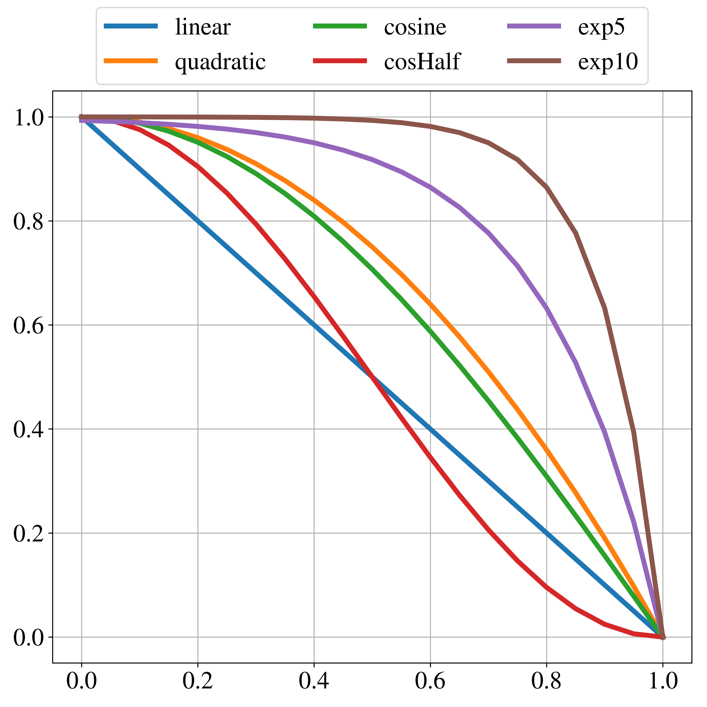

### Author:
- Rajib Roy
- University of Wyoming
- rroy@uwyo.edu, roy.rajib@live.com

### Description

Top level data entry class for use in dictionaries. Provides a mechanism to specify a variable as a certain type, e.g. constant or table, and provide functions to return the (interpolated) value, and integral between limits. Added fvMesh object to lookup any IOdictionary of IOobject.

Damping functions rely on a threshold value and a maximum value. Any value within the bound of threshold and max value, return a damping coeffs [0,1]. For values smaller than threshold vale aren't damped (dampCoef 1), and values larger than max value are completely damped (dampCoef 0).

Multiple damping functions are available (threshold value 0; maxValue 1 assumed):

